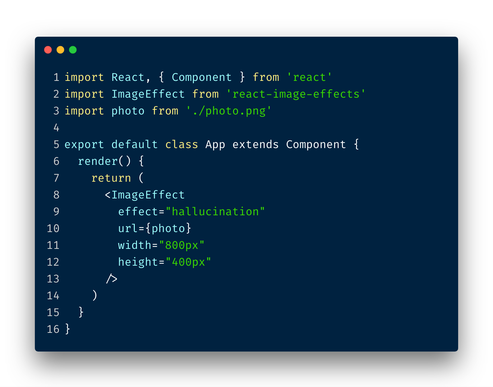

# react-image-effects

> A small, customizable react component that adds effects to images.

<p align="center">
  <a href="https://www.npmjs.com/package/react-image-effects">
    
  </a>
  <a href="https://www.npmjs.com/package/react-image-effects">
    
  </a>
  <a href="https://www.npmjs.com/package/react-image-effects">
    
  </a>
  <a href="https://standardjs.com">
    
  </a>
  <a href="https://circleci.com/gh/gokcan/react-shimmer">
    
  </a>
  <a href="https://codeclimate.com/github/cdrani/react-image-effects/maintainability">
    
  </a>
</p>

<p align="center">
  
</p>

### Install

`npm i react-image-effects`

or

`yarn add react-image-effects`

### Usage

```js
import ImageEffect from 'react-image-effects'

const Example = () => (
  <div>
    <ImageEffect
      url="./test.jpg"
      effect="airbrush"
      width="640px"
      height="360px"
    />
    <ImageEffect
      url="./subject.jpg"
      effect="infrared"
      width="640px"
      height="360px"
    >
      <p>Daytona</p>
    </ImageEffect>
  </div>
)
```

### Properties

| Prop     | Type   | Required | Default |
| :------- | :----- | :------- | :------ |
| `url`    | string | yes      |         |
| `effect` | enum   | no       | 'none'  |  |
| `width`  | string | no       | '600px' |  |
| `height` | string | no       | '300px' |

### Effects

Please reference documentation site to visualize the effects.

- [x] airbrush
- [x] chalkboard
- [x] collage
- [x] colored-chalkboard
- [x] colored-pencil
- [x] emboss
- [x] flannel
- [x] hallucination
- [x] infrared
- [x] low-ink-h
- [x] low-ink-v
- [x] mirror-h
- [x] mirror-v
- [x] mosaic
- [x] night-vision
- [x] none
- [x] pencil
- [x] photo-border
- [x] selective-color
- [x] warhol
- [x] watercolor

### Documentation

See the effects via storybook:
[react-image-effects](https://react-image-effects.now.sh)

### Development

**server**

`yarn storybook`

or

`npm run storybook`

storybook server will be opened on [localhost:8000](localhost:8000)

**build**

`yarn storybook:build`

or

`npm run storybook:build`

### Contributing

PRs are welcome.

### License

MIT &copy; | [@cdrani](https://github.com/cdrani)
